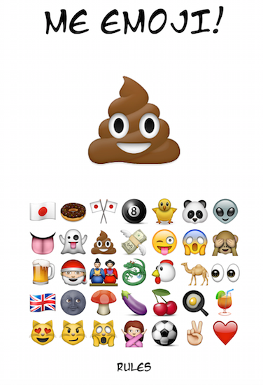

# Me Emoji Memory Game

##WDI London - Project 1

### A Modern Memory Brain Trainer

This is a memory game that uses Emoji's to test the players ability to recall a list of random Emojis.
Initially the game has a list of 3 Emoji's to remember, however this list increases with each successful recall of the list. 

[Test your ability here!](https://peaceful-savannah-3782.herokuapp.com/)

### Game Play
1. The user begins the game by selecting the 'Play' button on the main home screen.

2. The first list will be 3 Emoji's long. Each Emoji will display for 1 second.

3. The player must then repeat the list exactly. 

4. If the player correctly repeats the list the game will move on to the next round. The next round will repeat the initial 3 Emojis plus another randomly selected Emoji.

5. The game continues until the player incorrectly guesses the list. 

##Approach / how it works

When a player chooses to play the game, initially a random array f 

