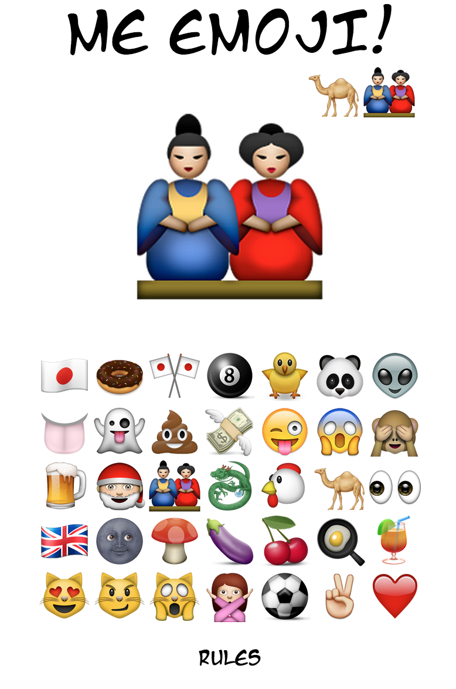

# Me Emoji Memory Game

##WDI London - Project 1

### A Modern Memory Brain Trainer

This is a memory game that uses Emoji's to test the players ability to recall a list of random Emojis.
Initially the game has a list of 3 Emoji's to remember, however this list increases with each successful recall of the list. 

[Test your ability here!](https://peaceful-savannah-3782.herokuapp.com/)

### Game Play
1. The user begins the game by selecting the 'Play' button on the main home screen.

2. The first list will be 3 Emoji's long. Each Emoji will display for 1 second.

3. The player must then repeat the list exactly. 

4. If the player correctly repeats the list the game will move on to the next round. The next round will repeat the initial 3 Emojis plus another randomly selected Emoji.

5. The game continues until the player incorrectly guesses the list. 

##Approach / how it works

When a player chooses to play the game, a random array of three Emoji objects is created from a larger 28 Emoji object array. A numerical value is connected to each array object and this is what is used in the arrays. This is then cycled through using an if/else loop and pushed to the background of the main screen with a time delay of 1 second between each image. During this time, an activity flag is used to prevent the player from being able to interact with the buttons.  

The player is then able to input their guess into the game which are pushed into a player array. These values or also prepended into a player selection bar at the top of the page, so that the player can see their guess as it is inputed. 

When the players inputed array length is equal to the game array length the arrays are checked against one another by converting the arrays into strings and checking one against the other in an if/else loop. If the guess is correct, the game array is repopulated with an extra Emoji icon added to the end of the current array and the game proceeds to the next round. If the guess is incorrect the game is over and the score is given. The score corresponds to the number of rounds that are completed. 

##The Build
- HTML 5, CSS and jQuery were used to create this game.
- Animation was achieved using special jQuery methods
- The font Manga-Temple was used from http://www.dafont.com/.

## Problems / Solutions
A large problem I encountered in this project was displaying the randomly ordered Emojis on the screen and getting them to disappear without overlapping one another or appearing to speed up. When using a setInterval timer I set up 2 counters, one for the round number and one as a counter for the index of the random array. Each time the setInterval looped it created a new function and overlapped the previous one, this gave the impression of the display speeding up. To combat this I used a clearInterval function so that each loop would just start a single new function. 

